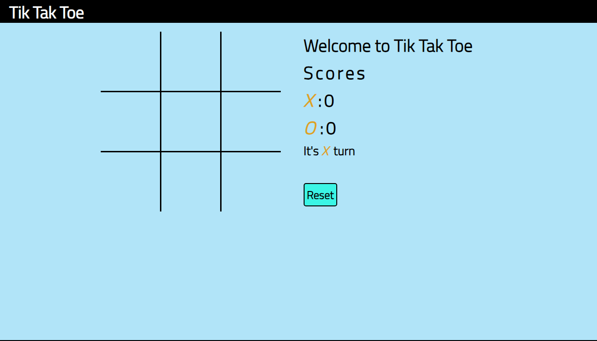
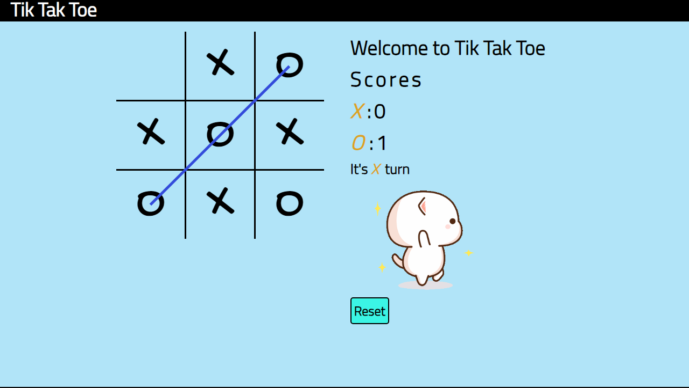

# TikTakToe

Welcome to TikTakToe! This is a simple implementation of the classic Tic-Tac-Toe game using HTML, CSS, and JavaScript.




## Table of Contents
- [Demo](#demo)
- [Features](#features)
- [Getting Started](#getting-started)
  - [Prerequisites](#prerequisites)
  - [Installation](#installation)
- [Usage](#usage)
- [Contributing](#contributing)
- [License](#license)

## Demo

You can play the game online at [TikTakToe](https://devrudraa.github.io/TikTakToe/).

## Features

- Classic Tic-Tac-Toe gameplay.
- Two-player mode.
- Simple and intuitive user interface.

## Getting Started

### Prerequisites

Before you begin, ensure you have met the following requirements:

- A modern web browser that supports HTML5 and JavaScript.

### Installation

1. Clone the repository:

   ```bash
   git clone https://github.com/devrudraa/TikTakToe.git
